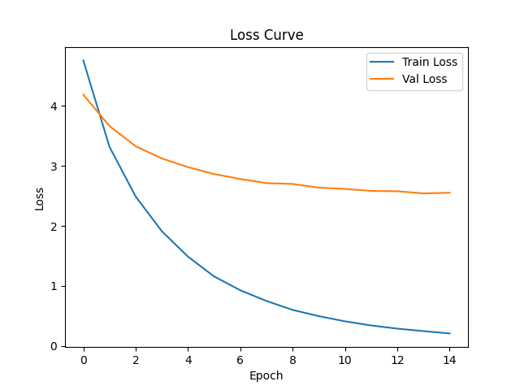
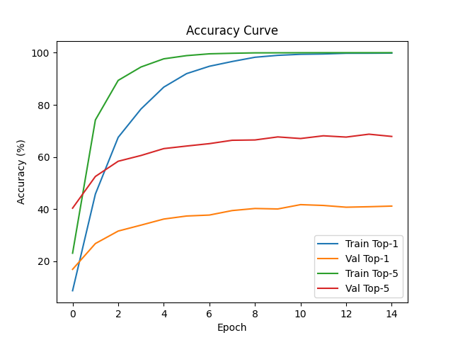
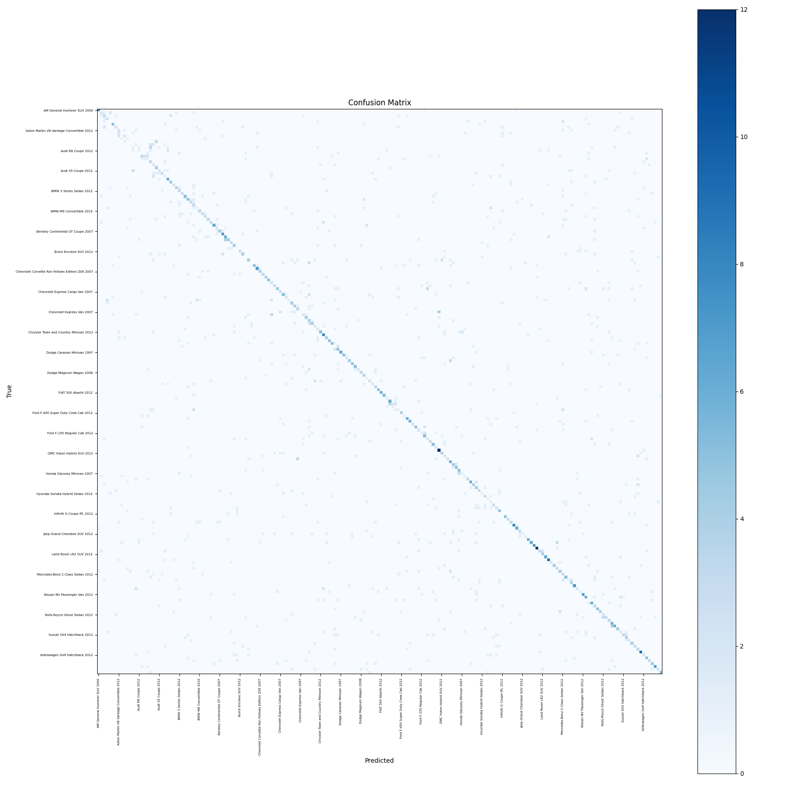

# Experiment Log

## Experiment: Baseline_single_head_classification
**Date:** 2025-11-23 22:14:09

### Changes
None, this is the baseline

### Reason
Measure a baseline to compare to

### Metrics
- Epoch 1: train_loss=4.756690376425192, train_top1=8.749040675218161, train_top5=23.131235606617317, val_loss=4.186660209852468, val_top1=16.942909751222352, val_top5=40.3928790715957
- Epoch 2: train_loss=3.318053653143226, train_top1=45.80199539055755, train_top5=74.2133537883861, val_loss=3.6642330931036513, val_top1=26.826273779403657, val_top5=52.547575204192384
- Epoch 3: train_loss=2.490202739763882, train_top1=67.53645432912104, train_top5=89.37835764207935, val_loss=3.3278836059453227, val_top1=31.614487395687583, val_top5=58.37937382088621
- Epoch 4: train_loss=1.9122096590326094, train_top1=78.4036837960607, train_top5=94.52033767407433, val_loss=3.1242336076487054, val_top1=33.88581952469125, val_top5=60.589318595684844
- Epoch 5: train_loss=1.4882188129681215, train_top1=86.7996930079193, train_top5=97.65157329240215, val_loss=2.979874514157674, val_top1=36.218538984482535, val_top5=63.22897483821
- Epoch 6: train_loss=1.157973064849309, train_top1=91.972371454012, train_top5=98.87950882578664, val_loss=2.863996946423825, val_top1=37.38489869213163, val_top5=64.21117249378183
- Epoch 7: train_loss=0.9280253464866398, train_top1=94.7966231772832, train_top5=99.57022256331543, val_loss=2.781894972457558, val_top1=37.75322283960838, val_top5=65.13198281856604
- Epoch 8: train_loss=0.7499706934345565, train_top1=96.62317728904789, train_top5=99.78511128165772, val_loss=2.712803054397424, val_top1=39.472068758520194, val_top5=66.42111726858046
- Epoch 9: train_loss=0.6008788244228407, train_top1=98.25019187078234, train_top5=99.93860322333077, val_loss=2.6990522366495058, val_top1=40.27010433976822, val_top5=66.54389197699054
- Epoch 10: train_loss=0.49735733464600396, train_top1=98.98695318495778, train_top5=99.95395241749809, val_loss=2.6380398860367036, val_top1=40.085942277153116, val_top5=67.71025170688617
- Epoch 11: train_loss=0.41091016428066235, train_top1=99.38603223330774, train_top5=99.9846508058327, val_loss=2.6165183726229353, val_top1=41.74340084068903, val_top5=67.09637815312713
- Epoch 12: train_loss=0.3419807001982665, train_top1=99.5088257866462, train_top5=100.0, val_loss=2.583307102313431, val_top1=41.436464080201695, val_top5=68.13996318632141
- Epoch 13: train_loss=0.2891655498162106, train_top1=99.78511128165772, train_top5=100.0, val_loss=2.577523599598875, val_top1=40.76120318394632, val_top5=67.64886435268114
- Epoch 14: train_loss=0.24772838785478177, train_top1=99.80046047582502, train_top5=100.0, val_loss=2.542328888247392, val_top1=40.945365236023584, val_top5=68.75383672837175
- Epoch 15: train_loss=0.20891222185294445, train_top1=99.84650805832693, train_top5=100.0, val_loss=2.552252348103064, val_top1=41.19091465284372, val_top5=67.89441376950127
- hierarchical_consistency: 0.5316144874155924
- accuracy_Chrysler: 0.48333333333333334
- accuracy_Ford: 0.4897959183673469
- accuracy_Hyundai: 0.5542168674698795
- accuracy_GMC: 0.5609756097560976
- accuracy_Toyota: 0.59375
- accuracy_Chevrolet: 0.5638297872340425
- accuracy_smart: 0.625
- accuracy_Suzuki: 0.3902439024390244
- accuracy_Bentley: 0.5357142857142857
- accuracy_Dodge: 0.5535714285714286
- accuracy_Acura: 0.46938775510204084
- accuracy_Volvo: 0.4666666666666667
- accuracy_Audi: 0.6018518518518519
- accuracy_Mitsubishi: 0.16666666666666666
- accuracy_Ferrari: 0.8181818181818182
- accuracy_Jeep: 0.5116279069767442
- accuracy_Eagle: 0.5555555555555556
- accuracy_Land Rover: 0.6428571428571429
- accuracy_Mercedes-Benz: 0.509090909090909
- accuracy_BMW: 0.5363636363636364
- accuracy_Ram: 0.8333333333333334
- accuracy_Lincoln: 0.6666666666666666
- accuracy_Bugatti: 0.5833333333333334
- accuracy_Fisker: 0.1111111111111111
- accuracy_Aston Martin: 0.4230769230769231
- accuracy_Honda: 0.4482758620689655
- accuracy_Daewoo: 0.45454545454545453
- accuracy_Buick: 0.4583333333333333
- accuracy_McLaren: 0.5
- accuracy_Volkswagen: 0.37037037037037035
- accuracy_Lamborghini: 0.6326530612244898
- accuracy_Infiniti: 0.38461538461538464
- accuracy_Spyker: 0.8888888888888888
- accuracy_Plymouth: 0.75
- accuracy_HUMMER: 0.9230769230769231
- accuracy_Mazda: 0.5714285714285714
- accuracy_Cadillac: 0.26666666666666666
- accuracy_Nissan: 0.3684210526315789
- accuracy_Scion: 0.5
- accuracy_AM: 0.8
- accuracy_Jaguar: 0.2
- accuracy_Rolls-Royce: 0.42857142857142855
- accuracy_Isuzu: 0.75
- accuracy_Tesla: 0.5
- accuracy_Geo: 1.0
- accuracy_FIAT: 0.8461538461538461
- accuracy_MINI: 0.75
- accuracy_Maybach: 0.3333333333333333
- accuracy_Porsche: 0.42857142857142855

### Results
Best Top-1 Accuracy = 41.74%, Hierarchical Consistency = 0.5316

--- Starting Phase 1 Baseline Evaluation ---
Test Set Size: 8041
----------------------------------------
1. Exact Car Accuracy (Hard):  41.72%  (Target for fine-tuning)
2. Make/Brand Accuracy (Easy): 52.82%  (Target for coarse features)
----------------------------------------
3. THE GAP:                    11.09% points

### Gemini thoughts on accuracy above
1. Exact Accuracy (42%): This is your floor. Your model is getting less than half of the cars right.

2. Make Accuracy (53%): This is surprisingly low. It means that nearly half the time, the model doesn't even know it's looking at a "BMW" vs. a "Ford."

3. The Gap (11%): This proves your hypothesis: Hierarchy matters. The model is significantly better at the "Easy" task (Make) than the "Hard" task (Model), but because you are using a standard flat classifier, it isn't effectively leveraging the easy task to help solve the hard one.

### Notes
Training finished. Logged curves, confusion matrix, sample image.

### Images / Plots

---

